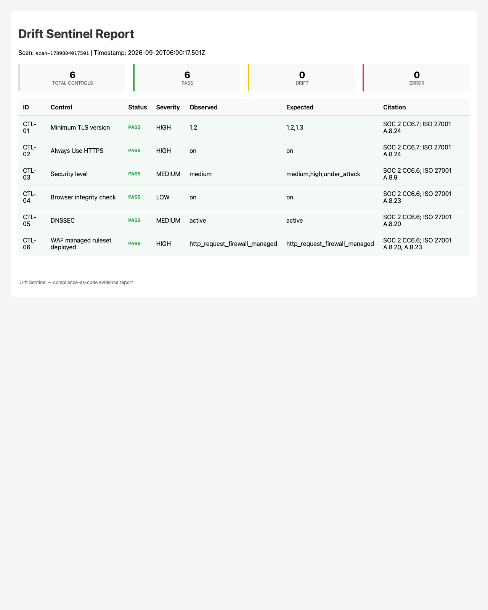
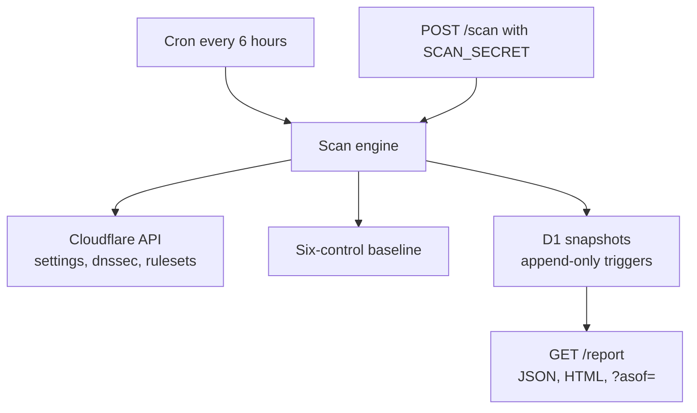

# Drift Sentinel

[](https://github.com/joseruiz1571/drift-sentinel/actions/workflows/ci.yml)

Drift Sentinel is a Cloudflare Worker that scans one zone (eggrollindex.com) against a six-control security baseline, writes each verdict as an append-only D1 row, and serves a public compliance report. Append-only evidence matters because a later change — to the zone, the scanner, or the story someone tells — cannot rewrite what the system asserted at a given time; "was this zone compliant on this date?" is answered by a row, not a memory.

[](https://drift-sentinel.builtbyjrv.workers.dev/report?format=html)

Live reports:

- [HTML report](https://drift-sentinel.builtbyjrv.workers.dev/report?format=html)
- [JSON report](https://drift-sentinel.builtbyjrv.workers.dev/report)

## Before and after

- **Before** (baseline gaps on this zone, never a prior good state): [`/report?asof=2026-09-19T13:00:00Z`](https://drift-sentinel.builtbyjrv.workers.dev/report?asof=2026-09-19T13:00:00Z)
- **After:** TODO(jose) — after zone remediations and the next scan, replace this placeholder with a live `/report?asof=<timestamp>` link. Do not invent a timestamp.

## Architecture



The Worker is live at `https://drift-sentinel.builtbyjrv.workers.dev` on the Cloudflare Free plan. A cron trigger (`0 */6 * * *`) starts after deploy; the first scheduled scan runs at the next 6-hour UTC boundary.

## Threat model

`/report` is public on purpose. It discloses zone settings that are already observable from outside (TLS minimum, HTTPS redirect, security level, browser check, DNSSEC, whether a managed WAF phase exists). It does not disclose raw Cloudflare API error text, tokens, or account credentials. `POST /scan` is protected by a required `SCAN_SECRET` compared in constant time; an unset secret fails closed with 503. The cron path scans without that secret. A D1 admin can still drop the append-only triggers.

## Non-goals

- Alerting
- Multiple zones
- Hash-chained or signed evidence
- Risk exceptions

## Control baseline

**Six controls**, all Free-plan auditable:

| ID | Control | Expected | Severity | Citation |
|---|---|---|---|---|
| CTL-01 | Minimum TLS version | 1.2+ | HIGH | SOC 2 CC6.7; ISO 27001 A.8.24 |
| CTL-02 | Always Use HTTPS | on | HIGH | SOC 2 CC6.7; ISO 27001 A.8.24 |
| CTL-03 | Security level | medium+ | MEDIUM | SOC 2 CC6.6; ISO 27001 A.8.9 |
| CTL-04 | Browser integrity check | on | LOW | SOC 2 CC6.6; ISO 27001 A.8.23 |
| CTL-05 | DNSSEC | active | MEDIUM | SOC 2 CC6.6; ISO 27001 A.8.20 |
| CTL-06 | WAF managed ruleset | deployed | HIGH | SOC 2 CC6.6; ISO 27001 A.8.20, A.8.23 |

Every control maps to specific Cloudflare APIs (settings, dnssec, rulesets). Drift is detected by comparing observed values against `allowed` values in the baseline.

The three current findings — minimum TLS 1.0 (CTL-01), Always Use HTTPS off (CTL-02), and DNSSEC disabled (CTL-05) — were never compliant on this zone. They are baseline gaps, not drift from a prior good state.

## Data model

### Snapshots table (D1)

```sql
CREATE TABLE snapshots (
  id TEXT PRIMARY KEY,
  scan_id TEXT,          -- unique identifier per scan run
  scan_timestamp INTEGER, -- unix milliseconds (indexed for ?asof queries)
  control_id TEXT,
  observed TEXT,         -- what the API returned
  expected TEXT,         -- baseline allowed values (comma-separated)
  status TEXT,           -- pass | drift | error
  detail TEXT,           -- error reason if status=error
  created_at INTEGER
);
```

**Append-only constraint:** `0002_append_only.sql` installs `BEFORE UPDATE` and `BEFORE DELETE` triggers on `snapshots`. That is not enough: `INSERT OR REPLACE` / `REPLACE INTO` overwrite an existing primary key without firing those triggers and without raising an error. `0003_block_replace.sql` adds a `BEFORE INSERT` trigger that `RAISE(ABORT)` when `NEW.id` already exists. New scans INSERT rows; UPDATE, DELETE, and REPLACE are rejected by the database. Limit: someone with D1 admin access can still drop the triggers. This design:

- Preserves the audit trail (every decision is a row)
- Enables point-in-time queries (`?asof=`)
- Prevents accidental data loss
- Makes the evidence chain auditable

## API examples

### Trigger a scan

```bash
curl -X POST -H "Authorization: Bearer $SCAN_SECRET" https://drift-sentinel.builtbyjrv.workers.dev/scan
```

`/scan` is POST-only (GET returns 405) — a GET endpoint that writes evidence rows would let any crawler burn subrequest quota and pollute the audit trail. `SCAN_SECRET` is required: if it is unset or empty, `POST /scan` returns 503 and writes nothing. A missing or wrong bearer token returns 401. The cron trigger scans without a secret.

Returns:

```json
{
  "scan_id": "scan-1723391400000",
  "results": [
    {
      "id": "CTL-01",
      "name": "Minimum TLS version",
      "observed": "1.3",
      "expected": ["1.2", "1.3"],
      "status": "pass",
      "severity": "high",
      "citation": "SOC 2 CC6.7; ISO 27001 A.8.24"
    }
  ]
}
```

### Latest compliance report (JSON)

```bash
curl https://drift-sentinel.builtbyjrv.workers.dev/report
```

`/report` is cached in the Worker isolate for about 60 seconds so repeated hits do not each cost D1 reads. Point-in-time (`?asof=`) responses for a past timestamp are cached for 24 hours, because that evidence cannot change. Cloudflare's Cache API is documented as functional on custom domains and Pages Functions, not as a guarantee on `*.workers.dev`, which is where this Worker is served.

### Compliance report as HTML

```bash
curl https://drift-sentinel.builtbyjrv.workers.dev/report?format=html
```

Renders a readable table with status summary, per-control results, and framework citations. See the [live HTML report](https://drift-sentinel.builtbyjrv.workers.dev/report?format=html).

### Point-in-time query

```bash
curl "https://drift-sentinel.builtbyjrv.workers.dev/report?asof=2026-08-11T06:00:00Z"
```

Returns the compliance state as of that timestamp (the latest scan on or before that time). The lookup uses `idx_scans_timestamp` (`scan_timestamp DESC`) with `WHERE scan_timestamp <= ? ORDER BY scan_timestamp DESC LIMIT 1`, then loads that scan's rows via `idx_scan_id`. It does not scan the full table.

## Token hygiene

**Read-only API token:**

- Exact Cloudflare permission names, scoped to the single zone (eggrollindex.com): **Zone Settings Read**, **DNS Read**, **Zone WAF Read**
- Stored via `wrangler secret put CF_API_TOKEN` (never committed)
- `wrangler whoami` checks Wrangler's OAuth login, not this API token. Confirm the token by a successful authenticated `POST /scan` that returns observed values.
- No literal token appears in code (read from the Worker secret binding)
- A leaked token cannot change zone settings (read-only, one zone)

**Scan trigger secret** (required for `POST /scan`):

- `wrangler secret put SCAN_SECRET` — `Authorization: Bearer <SCAN_SECRET>`
- Local dev: copy `.dev.vars.example` to `.dev.vars` (gitignored)

**Zone ID** (public):

- `838bd540f4c21f053378ea01854d9363` (eggrollindex.com)
- Not secret; publicly derivable from DNS

## Governance rationale

Why append-only evidence?

Standard compliance monitoring tunes thresholds on a Tuesday, and the policy the board approves on Wednesday is a different thing than what the system ran last Monday. Append-only snapshots create a documented loop: the system asserts what is true; the assertion is auditable; the assertion binds the evidence trail. If someone asks "was this zone compliant on July 15th?" the answer comes from a row, not a memory.

Drift Sentinel is that pattern applied to zone configuration: **declared state → scan → evidence → report**. Every step is reversible via the query interface. The cron-scanned results are not scrubbed, not aggregated away, not even summarized — they are rows in a table. That is the difference between monitoring and audit readiness.

## At scale: what breaks

This design is validated for a single zone (eggrollindex.com) on Cloudflare's Free plan. Current constraints:

- **Subrequests:** A scan makes 6 outbound API calls (one per control). The Free plan limit is **50 subrequests per invocation**, not per minute. A 6-hour cron stays well inside that per-request cap.
- **D1:** About 6 rows per scan, 4 scans/day ≈ 24 rows written/day. Free-plan D1 allows **5 million rows read/day**, **100,000 rows written/day**, **5 GB** account storage and **500 MB** per database. Row count per table is unlimited except by those storage limits. Daily read/write limits reset at 00:00 UTC.
- **Query latency:** `?asof=` uses the `scan_timestamp` index (`idx_scans_timestamp`) plus `idx_scan_id`. It is not a full-table scan.
- **Multiple zones:** Not implemented. Would need a zone parameter and either a loop or parallel Workers.

Pages Functions bind the same D1 product and the same daily row limits, so moving this Worker to Pages does not raise the D1 cap. If a D1 limit is the constraint, archive old snapshots or upgrade the Workers plan.

## Deployment

`wrangler.jsonc` already names the Worker, the D1 binding (`DB` / `drift-sentinel`), the zone/account vars, and the cron (`0 */6 * * *`). There is no `migrations` key; Wrangler uses the default `./migrations` directory.

1. Fork or clone this repo
2. Install dependencies: `bun install`
3. Authenticate Wrangler: `bunx wrangler login`
4. Create a read-only API token (profile → API Tokens) with **Zone Settings Read**, **DNS Read**, and **Zone WAF Read**, scoped to one zone
5. Store secrets: `bunx wrangler secret put CF_API_TOKEN` and `bunx wrangler secret put SCAN_SECRET`
6. If you need a new database: `bunx wrangler d1 create drift-sentinel`, then put the returned `database_id` in `d1_databases[0].database_id`
7. Apply both migrations, in order: `bunx wrangler d1 migrations apply drift-sentinel --remote`  
   (`0001_snapshots.sql`, then `0002_append_only.sql`, then `0003_block_replace.sql`)
8. Deploy: `bunx wrangler deploy`
9. The cron trigger starts after deploy; the first scheduled scan runs at the next 6-hour UTC boundary. Or trigger one immediately:

    ```bash
    curl -X POST -H "Authorization: Bearer $SCAN_SECRET" https://<your-subdomain>.workers.dev/scan
    curl https://<your-subdomain>.workers.dev/report
    ```

## Tests

`bunx vitest run` — the suite runs inside the Workers runtime via `@cloudflare/vitest-pool-workers`: real D1 (migrations applied per test file), the Cloudflare API mocked at the fetch layer. Covers routing, scan auth, drift and API-error detection, snapshot persistence, point-in-time queries, and HTML escaping.

## Repository

- **License:** MIT
- **Framework coverage:** SOC 2 CC6.x, ISO 27001 Annex A.8
- **Code:** TypeScript. No runtime dependencies. Zone reads use `fetch()` against the Cloudflare HTTP API; there is no Cloudflare SDK.
- **Evidence:** Append-only D1 snapshots, point-in-time queryable

---

**Author:** Jose Ruiz-Vazquez | Controlled Vocabulary
